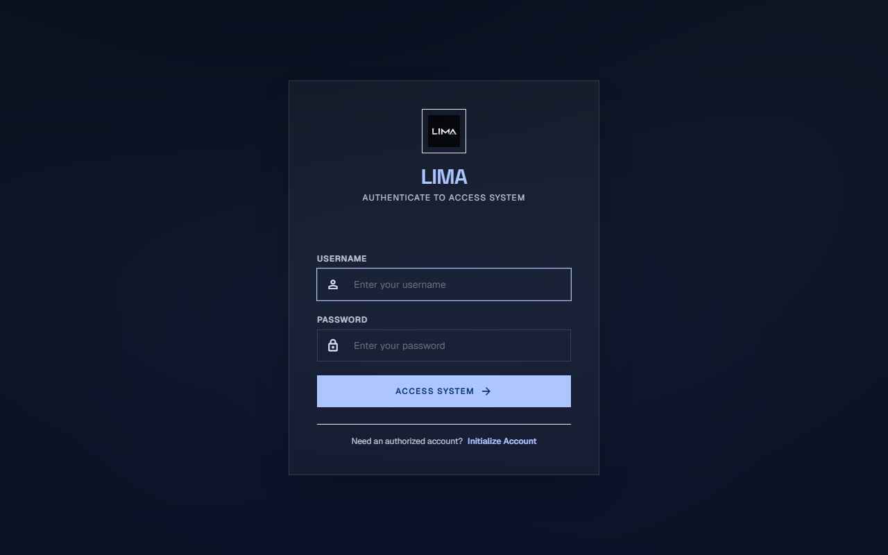
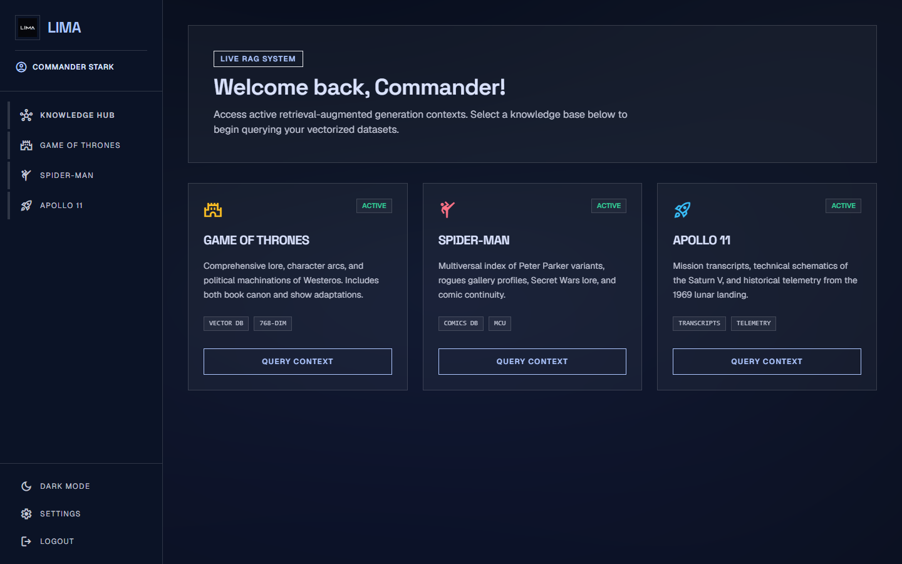
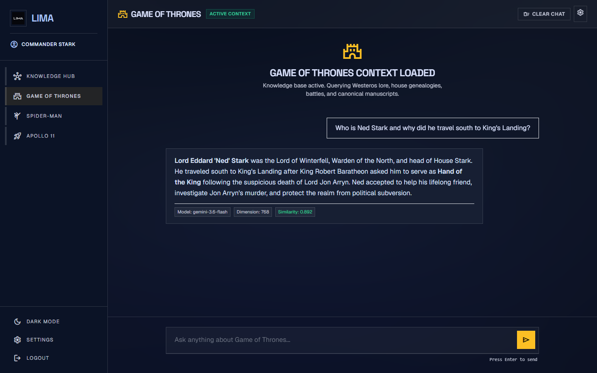

# ⚡ LIMA — Intelligent Multi-Domain RAG Platform

<p align="center">
  <strong>An elite, high-performance Retrieval-Augmented Generation platform pairing deep domain vector intelligence with bespoke cyber-brutalist aesthetics.</strong>
</p>

<p align="center">
  
  
  
  
  
</p>

---

## 🌟 The Vision

Most Retrieval-Augmented Generation (RAG) applications feel like generic prototypes: plain white textboxes connected to slow, brittle vector endpoints. 

**LIMA** redefines the standard. Engineered from the ground up as a premier knowledge exploration command center, LIMA bridges multi-layered fictional lore, multiversal comic continuity, and complex spaceflight telemetry into a fluid, sub-second conversational experience. 

Powered by **768-dimensional dense vector projections**, an automated **self-healing dual-tier API failover system**, and a **hardware-accelerated WebGL shader interface**, LIMA delivers conversational AI that is as visually breathtaking as it is technically authoritative.

---

## 📸 The Experience

### 1. Command Center Access
A secure, high-contrast authentication gate built with cyber-brutalist ergonomics, providing personalized command sessions and access control.

<p align="center">
  
</p>

---

### 2. The Knowledge Hub
A dynamic dashboard orchestrating multiple independent vector databases. Users can seamlessly navigate between distinct domains with real-time indexing statuses and dimensional badges.

<p align="center">
  
</p>

---

### 3. Context-Aware Intelligence Engine
The core query experience in action. Notice the contextual precision: instantaneous vector search, top-match retrieval scoring, generation token telemetry, and deep narrative grounding.

<p align="center">
  
</p>

---

## 🚀 Why LIMA Stands Apart

### 🏛️ Three Vast, Autonomous Knowledge Universes
LIMA does not rely on superficial Wikipedia summaries. Each domain is an extensively chunked, densely vectorized knowledge repository:
- **Game of Thrones**: Comprehensive lore across Westeros and Essos, noble House genealogies, political conspiracies, historical battles, and canonical manuscripts from both the books and television adaptations.
- **Spider-Man**: A massive multiversal codex spanning Peter Parker variants, rogues gallery dossiers, Secret Wars storylines, and MCU/comic book timelines.
- **Apollo 11**: Real NASA mission flight transcripts, technical propulsion schematics of the Saturn V launch vehicle, and historical 1969 lunar landing telemetry.

### 🎯 High-Density 768-Dimension Semantic Precision
While conventional pipelines suffer from sparse matching or memory bloat, LIMA leverages dense 768-dimensional semantic embeddings. This captures complex nuance—such as character motives, scientific nomenclature, and covert political subtext—with pinpoint cosine similarity accuracy.

### 🛡️ Self-Healing Dual-Tier Failover Engine
Production RAG systems frequently fail when single API keys hit quota limits or HTTP 429 rate throttles. LIMA incorporates a proactive **Primary ➔ Secondary key failover mechanism**. If the primary key is exhausted during high traffic or extensive batch processing, the pipeline switches to the backup engine in milliseconds without dropping the user turn or displaying an error.

### 🔒 Resilient Error Shielding
Technical exceptions, rate limits, and network latency anomalies are logged strictly to internal developer logs. Users are never subjected to confusing stack traces, raw error codes, or broken UIs. Instead, LIMA guarantees graceful, polished, and polite conversational continuity at all times.

### 🎨 Cyber-Brutalist & Real-Time WebGL Aesthetics
LIMA treats visual design as a core engineering feature:
- **Ambient WebGL Fragment Shader**: A live mathematical color-wave animation rendered on an interactive canvas in the background.
- **7 Live Appearance Profiles**: Effortlessly shift between *Midnight Glass*, *Dark Contrast*, *Cosmic Purple*, *Deep Ocean*, *Sunset Fire*, *Forest*, and *Light Mode* without page reloads.
- **Brutalist Glassmorphism**: Frosted blur panels, razor-sharp typography, and reactive glow focus states.

### 📊 Real-Time Observability & Token Telemetry
Every bot response provides transparent operational metrics directly inside the UI:
- **Similarity Scoring**: Exact cosine affinity score of the top-retrieved passage.
- **Generation Model Tag**: Model identity and provider badge.
- **Token Throughput**: Tokens generated per second (TPS) and total turn duration.

### 🔄 Dual-Layer Continuous History Sync
Conversations are preserved in real-time across both Supabase cloud tables and local browser storage. Users can clear history at will, switch between knowledge bases, and resume right where they left off across different sessions.

---

## 🌐 The LIMA Knowledge Ecosystem

```text
                                 ┌────────────────────────┐
                                 │   LIMA KNOWLEDGE HUB   │
                                 └───────────┬────────────┘
                                             │
               ┌─────────────────────────────┼─────────────────────────────┐
               │                             │                             │
    ┌──────────▼──────────┐       ┌──────────▼──────────┐       ┌──────────▼──────────┐
    │   GAME OF THRONES   │       │     SPIDER-MAN      │       │      APOLLO 11      │
    ├─────────────────────┤       ├─────────────────────┤       ├─────────────────────┤
    │ • Westeros Canon    │       │ • Multiverse Index  │       │ • Mission Audios    │
    │ • House Lineages    │       │ • Rogue Profiles    │       │ • Saturn V Schematics│
    │ • Battle Strategies │       │ • Comic Continuities│       │ • Lunar Telemetry   │
    │ • Dynastic History  │       │ • MCU Timelines     │       │ • Flight Transcripts│
    └─────────────────────┘       └─────────────────────┘       └─────────────────────┘
```

---

## 💎 Crafted for Performance, Built for Delight

LIMA showcases what modern agentic AI and RAG architecture can achieve when powerful retrieval algorithms meet world-class front-end craftsmanship. It is fast, resilient, visually striking, and intellectually grounded.

*For deep architectural diagrams, mathematical formulations, and engineering deep-dives, explore **[`tech.md`](tech.md)**.*
