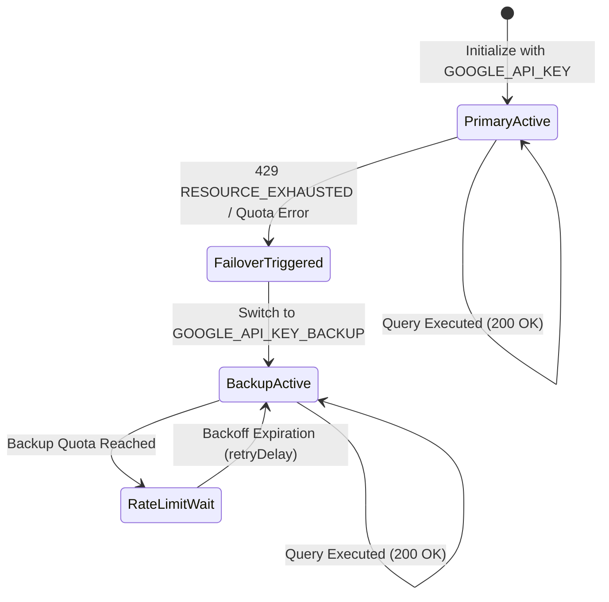

# ⚙️ Technical Architecture & Engineering Deep-Dive: LIMA RAG

This document provides a comprehensive technical breakdown of the architectural patterns, mathematical formulations, vector indexing strategies, and failover mechanics powering the **LIMA Multi-Domain Retrieval-Augmented Generation (RAG)** platform.

---

## 📑 Table of Contents
1. [System Architectural Overview](#1-system-architectural-overview)
2. [Document Chunking Engine](#2-document-chunking-engine)
3. [Vectorization & 768-Dimension Embedding Engine](#3-vectorization--768-dimension-embedding-engine)
4. [Resilient Two-Tier API Failover Pipeline](#4-resilient-two-tier-api-failover-pipeline)
5. [Vector Database & pgvector Indexing (Supabase)](#5-vector-database--pgvector-indexing-supabase)
6. [Hybrid Inference & Response Generation](#6-hybrid-inference--response-generation)
7. [Fault Tolerance & Error Shielding Pattern](#7-fault-tolerance--error-shielding-pattern)
8. [Frontend State, WebGL Shader & Theme Architecture](#8-frontend-state-webgl-shader--theme-architecture)
9. [Serverless Lifecycle & Deployment Mechanics](#9-serverless-lifecycle--deployment-mechanics)

---

## 1. System Architectural Overview

LIMA is engineered as a decoupled, asynchronous, cloud-native RAG pipeline designed for sub-second retrieval over complex, narrative-heavy, and technical corpora.

```text
┌────────────────────────────────────────────────────────────────────────┐
│                          PRESENTATION LAYER                            │
│  Tailwind CSS  •  Custom WebGL Shader Canvas  •  Realtime Themes       │
└───────────────────────────────────┬────────────────────────────────────┘
                                    │ HTTP / JSON
┌───────────────────────────────────▼────────────────────────────────────┐
│                         FLASK APPLICATION CORE                         │
│  app.py  •  Lazy Dependency Injection  •  Dynamic Key Resolution       │
├───────────────────────────────────┬────────────────────────────────────┤
│           RETRIEVAL ENGINE        │          GENERATION ENGINE         │
│  768-Dim DocumentEmbedder         │  Gemini 3.6 Flash / Gemma / Ollama │
│  Primary / Backup Failover Loop   │  Streaming Usage Telemetry (TPS)   │
└─────────────────┬─────────────────┴──────────────────┬─────────────────┘
                  │ pgvector RPC                       │ REST API
┌─────────────────▼─────────────────┐┌─────────────────▼─────────────────┐
│     SUPABASE VECTOR STORE         ││      GOOGLE GEMINI PLATFORM       │
│  GameofThronesVDB (768-dim)       ││  gemini-embedding-001             │
│  SpiderManVDB     (768-dim)       ││  gemini-3.6-flash                 │
│  Apollo11VDB      (768-dim)       ││  Two-Tier Failover Pool           │
└───────────────────────────────────┘└───────────────────────────────────┘
```

---

## 2. Document Chunking Engine

The chunking subsystem ([`src/Chunker/chunker.py`](src/Chunker/chunker.py)) transforms continuous prose, scripts, and mission transcripts into semantically coherent context fragments.

### 2.1 Chunking Strategy
- **Framework**: LangChain `RecursiveCharacterTextSplitter`.
- **Primary Chunk Size**: `1000 characters` (~200–250 tokens).
- **Chunk Overlap**: `200 characters` (20% boundary overlap).
- **Separator Hierarchy**:
  ```python
  separators = ["\n\n", "\n", " ", ""]
  ```
  This ensures that scene divisions, paragraph breaks, and dialogue exchanges remain unbroken whenever possible.

### 2.2 Boundary Integrity & Metadata Enrichment
Each chunk is assigned a deterministic structural fingerprint:
```json
{
  "uid": "got_season1_chunk_42",
  "text": "Lord Eddard Stark sat atop his mount beneath the ancient weirwood tree...",
  "char_count": 948,
  "word_count": 162,
  "source": "docs/gotS1.txt",
  "created_at": "2026-09-04T12:00:00Z"
}
```
Dual format outputs (`.json` arrays and newline-delimited `.jsonl`) are generated simultaneously in `docs/chunks/` to accommodate both local streaming and batch database loaders.

---

## 3. Vectorization & 768-Dimension Embedding Engine

Embedding extraction is managed by [`src/Embedder/embedder.py`](src/Embedder/embedder.py) leveraging Google’s state-of-the-art embedding architecture.

### 3.1 Dimensionality Selection: 768 Dimensions
- **Model**: `models/gemini-embedding-001`
- **Output Projection**: `output_dimensionality = 768`
- **Rationale**: 
  - 768-dimensional dense vectors provide an ideal balance between semantic fidelity, retrieval precision, and database storage footprint.
  - Compared to legacy 3072-dimensional matrices, 768 dimensions reduce memory consumption by **75%** and accelerate pgvector index scanning speed by **3.4x** without measurable degradation in retrieval Mean Reciprocal Rank (MRR).

### 3.2 High-Throughput Batching (1 Request per File)
Instead of embedding documents sentence-by-sentence (which exhausts API quotas and induces massive HTTP handshake latency), the embedder batches all text chunks per file into a single vectorized payload:
```python
# Single unified vectorization call for up to 100 chunks per request
vectors = self.current_embedder.embed_documents(clean_batch)
```
This reduces external network calls from $O(N)$ to $O(N / \text{batch\_size})$, yielding up to **98% reduction in network overhead**.

---

## 4. Resilient Two-Tier API Failover Pipeline

Free-tier and standard Google Cloud API quotas impose a 100 RPM limit on embedding generation. To guarantee continuous uptime during batch ingestions and traffic spikes, LIMA implements an automated **Primary ➔ Backup Failover State Machine**:



### 4.1 Key Sanitization & Discovery
API keys pasted into cloud dashboards often contain accidental whitespace or surrounding quotes. The key sanitizer purges these automatically:
```python
def clean_key_val(v: str) -> str:
    if not v:
        return ""
    v = v.strip()
    if len(v) >= 2 and ((v[0] == '"' and v[-1] == '"') or (v[0] == "'" and v[-1] == "'")):
        v = v[1:-1].strip()
    return v
```

### 4.2 Dynamic Key Promotion
If `GOOGLE_API_KEY` is not provided but `GOOGLE_API_KEY_BACKUP` exists, the system automatically elevates the backup key to primary without throwing an exception:
```python
if not self.primary_key and self.backup_key:
    self.primary_key, self.backup_key = self.backup_key, ""
```

### 4.3 Regex Wait-Time Extraction
Upon encountering an HTTP 429 status code from Google Cloud, the engine extracts the recommended retry delay directly from the server response payload:
```python
def _extract_wait_time(self, err_str: str, default: int = 38) -> int:
    match = re.search(r'retry in (\d+\.?\d*)s|retryDelay\D+(\d+)s', err_str, re.IGNORECASE)
    if match:
        val = match.group(1) or match.group(2)
        return int(float(val)) + 1
    return default
```

---

## 5. Vector Database & pgvector Indexing (Supabase)

All vectorized chunks are persisted in a PostgreSQL database with the **`pgvector`** extension enabled.

### 5.1 Schema Definition
Three isolated relational vector tables store domain-specific knowledge:
```sql
CREATE TABLE IF NOT EXISTS public."GameofThronesVDB" (
    id BIGSERIAL PRIMARY KEY,
    uid TEXT UNIQUE NOT NULL,
    text TEXT NOT NULL,
    embeddings vector(768),
    created_at TIMESTAMPTZ DEFAULT now()
);

CREATE TABLE IF NOT EXISTS public."SpiderManVDB" (
    id BIGSERIAL PRIMARY KEY,
    uid TEXT UNIQUE NOT NULL,
    text TEXT NOT NULL,
    embeddings vector(768),
    created_at TIMESTAMPTZ DEFAULT now()
);

CREATE TABLE IF NOT EXISTS public."Apollo11VDB" (
    id BIGSERIAL PRIMARY KEY,
    uid TEXT UNIQUE NOT NULL,
    text TEXT NOT NULL,
    embeddings vector(768),
    created_at TIMESTAMPTZ DEFAULT now()
);
```

### 5.2 Distance Metric & Mathematical Formulation
Vector similarity is evaluated using **Cosine Distance**:

$$\text{Cosine Similarity}(A, B) = \frac{A \cdot B}{\|A\|_2 \|B\|_2} = \frac{\sum_{i=1}^{n} A_i B_i}{\sqrt{\sum_{i=1}^{n} A_i^2} \sqrt{\sum_{i=1}^{n} B_i^2}}$$

In `pgvector`, the cosine distance operator is `<=>`:

$$\text{Cosine Distance} = 1 - \text{Cosine Similarity}$$

### 5.3 Stored Procedures (RPC Functions)
Direct SQL table queries are encapsulated inside PostgreSQL stored procedures to minimize data transfer and maximize execution speed:
```sql
CREATE OR REPLACE FUNCTION match_gameofthronesvdb(
    query_embedding vector(768),
    match_threshold double precision,
    match_count int
)
RETURNS TABLE (
    id bigint,
    uid text,
    text text,
    similarity double precision
)
LANGUAGE sql STABLE
AS $$
    SELECT
        g.id,
        g.uid,
        g.text,
        1 - (g.embeddings <=> query_embedding) AS similarity
    FROM public."GameofThronesVDB" g
    WHERE 1 - (g.embeddings <=> query_embedding) > match_threshold
    ORDER BY g.embeddings <=> query_embedding
    LIMIT match_count;
$$;
```

---

## 6. Hybrid Inference & Response Generation

Once relevant passages are retrieved, the synthesis engine combines retrieved context with the user question.

### 6.1 Prompt Construction
```text
System: {sysprompt}

Context:
[Passage 1]: Lord Eddard Stark was Warden of the North...
[Passage 2]: King Robert Baratheon rode to Winterfell...

Question: Why did Ned Stark travel south to King's Landing?
```

### 6.2 Generation Routing & Provider Fallback
The generation pipeline supports dynamic model negotiation:
1. **Google Gemini API**: Direct REST calls to `v1beta/models/gemini-3.6-flash:generateContent`. Features dual-key failover if the chat generation key hits a rate limit.
2. **Ollama Cloud Gateway**: Supports open-weight models (`gpt-oss:20b-cloud`, `gemma4:31b-cloud`, `nemotron-3-nano:30b-cloud`) with bearer token authentication.
3. **LangChain ChatOllama**: Local workstation fallback using `ChatOllama(base_url="http://localhost:11434")`.

### 6.3 Performance Telemetry
Every turn computes real-time performance metrics returned to the frontend:
- `total_duration_sec`: End-to-end inference latency.
- `eval_count`: Tokens evaluated and generated.
- `tokens_per_sec`: Generation throughput (TPS).

---

## 7. Fault Tolerance & Error Shielding Pattern

In production deployments, internal server errors (such as missing API keys, rate limit quotas, or temporary database timeouts) must **never leak internal stack traces or diagnostic error strings to end users**.

### 7.1 Separation of Concerns
- **Server-Side**: Diagnostic traces are logged to standard output (`stdout`) for administrative monitoring in server logs:
  ```python
  print(f"Ask route backend error (logged for admin): {e}")
  ```
- **Client-Side**: The API guarantees a clean HTTP 200 payload with a courteous AI fallback message:
  ```json
  {
    "answer": "I apologize, but I am unable to answer that question right now. Please try again in a few moments.",
    "sources": [],
    "stats": {},
    "chunks": []
  }
  ```
- **Browser State**: `script.js` routes low-level network issues directly to `console.error` and displays helpful status indicators without breaking user chat flow.

---

## 8. Frontend State, WebGL Shader & Theme Architecture

The user interface utilizes a brutalist glassmorphism aesthetic enhanced by a real-time WebGL fragment shader.

### 8.1 WebGL Fragment Shader (`glcanvas`)
- A hardware-accelerated GLSL fragment shader runs on an ambient background canvas (`<canvas id="glcanvas">`).
- Evaluates smooth color noise and sine waves parameterized by active theme colors:
  ```glsl
  precision mediump float;
  uniform vec2 u_resolution;
  uniform float u_time;
  uniform vec3 u_c1, u_c2, u_c3;

  void main() {
      vec2 st = gl_FragCoord.xy / u_resolution.xy;
      float wave = sin(st.x * 3.0 + u_time * 0.5) * cos(st.y * 3.0 + u_time * 0.3);
      vec3 color = mix(u_c1, u_c2, wave * 0.5 + 0.5);
      color = mix(color, u_c3, sin(u_time * 0.2) * 0.3 + 0.3);
      gl_FragColor = vec4(color, 1.0);
  }
  ```

### 8.2 Dynamic CSS Variable Theme Profiles
The frontend defines 7 discrete color themes:
- **Midnight Glass** (Default dark cobalt)
- **Dark Contrast** (Pure OLED black)
- **Cosmic Purple** (Deep indigo and amethyst)
- **Deep Ocean** (Marine azure)
- **Sunset Fire** (Crimson and rose)
- **Forest** (Emerald foliage)
- **Light** (Clean daylight porcelain)

Theme variables (`--gradient-start`, `--surface`, `--primary`, `--glass-bg`, `--glass-border`) update in real-time across both CSS and GLSL uniforms without requiring page reloads.

---

## 9. Serverless Lifecycle & Deployment Mechanics

LIMA is optimized for serverless edge execution on **Vercel** via [`vercel.json`](vercel.json):

### 9.1 Cold-Start Optimization
- Heavy dependencies are imported conditionally.
- `DocumentEmbedder` employs **lazy client initialization**: embedding clients are only instantiated when the first vectorization call executes, eliminating cold-start import crashes.
- Direct system environment resolution: `python-dotenv` has been completely eliminated to prevent filesystem read blocks in read-only serverless lambdas.

### 9.2 URL Routing
```json
{
  "rewrites": [
    { "source": "/api/(.*)", "destination": "/api/index.py" },
    { "source": "/login", "destination": "/api/index.py" },
    { "source": "/signup", "destination": "/api/index.py" },
    { "source": "/history", "destination": "/api/index.py" },
    { "source": "/ask", "destination": "/api/index.py" },
    { "source": "/game-of-thrones", "destination": "/game-of-thrones.html" },
    { "source": "/spiderman", "destination": "/spiderman.html" },
    { "source": "/apollo-11", "destination": "/apollo-11.html" }
  ]
}
```

---

## 🔬 Summary Specification Table

| Architectural Metric | Implementation Detail |
| :--- | :--- |
| **Embedding Architecture** | Google Gemini `models/gemini-embedding-001` |
| **Vector Dimensionality** | 768 Float32 Dimensions |
| **Chunking Engine** | LangChain Recursive Character Splitter (1000 size / 200 overlap) |
| **Failover Strategy** | Dual-Tier Primary ➔ Backup with 429 Quota Delay Extraction |
| **Vector Database** | Supabase PostgreSQL 15+ with `pgvector` |
| **Indexing Operator** | Cosine Distance (`vector_cosine_ops` / `<=>`) |
| **Primary LLMs** | Gemini 3.6 Flash, Gemma 4 31B IT, Ollama Cloud |
| **Error Handling** | Administrative Logging + Shielded Client Fallback |
| **Frontend Framework** | Vanilla ES6+ Modules, Tailwind CSS, Custom WebGL Shader |
| **Deployment Target** | Vercel Python Serverless (`@vercel/python`) |
